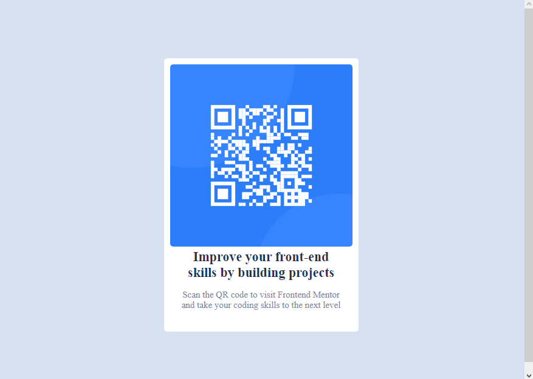

# Frontend Mentor - QR code component solution

This is a solution to the [QR code component challenge on Frontend Mentor](https://www.frontendmentor.io/challenges/qr-code-component-iux_sIO_H). Frontend Mentor challenges help you improve your coding skills by building realistic projects. 

I'm knew with this front end thing because I prefer the back end more, I like more working on the server site but I know that front is also very very important so I'm giving a try to the challenges of this page. 

## Table of contents

- [Overview](#overview)
  - [Screenshot](#screenshot)
  - [Links](#links)
- [My process](#my-process)
  - [Built with](#built-with)
  - [What I learned](#what-i-learned)
  - [Useful resources](#useful-resources)
- [Author](#author)

**Note: Delete this note and update the table of contents based on what sections you keep.**

## Overview

### Screenshot



The image above is the screenshot from my browser, so you can see clearly the result of my work. I'm not the best in design so I would appreciate if anyone give me a comment, feel free to do it.

### Links

- Solution URL: [You can find the repository here](https://github.com/IsaacLezama/qr-code-component.git)

## My process

### Built with

- Semantic HTML5 markup
- CSS styles
- Use of Flexbox

As the challenge wasn't very big or complicated I wrote the HTML and CSS code in one single file (the index.html)

### What I learned

I had troubles with centering the content of the card and the card itself so I'd like to show how I made it.

```html
<div class="container">
    <div class="card">
      
    
      <div class="title-card">
        Improve your front-end skills by building projects
      </div>
  
      <div class="card-content">
        <p>Scan the QR code to visit Frontend Mentor and take your coding skills to the next level</p>
      </div>
      
    </div>
  </div>
```
```css
.container {
      display: flex;
      width: 100%;
      height: 100vh;
      align-items: center;
    }
```
### Useful resources

- [Example resource 1](https://www.dariobf.com/centrar-verticalmente-con-css-6-formas-diferentes-de-lograrlo/) - This helped me when I couldn't find a solution about centering the card.

## Author

- Github - [](https://github.com/IsaacLezama)
- Frontend Mentor - [@IsaacLezama](https://www.frontendmentor.io/profile/IsaacLezama)
